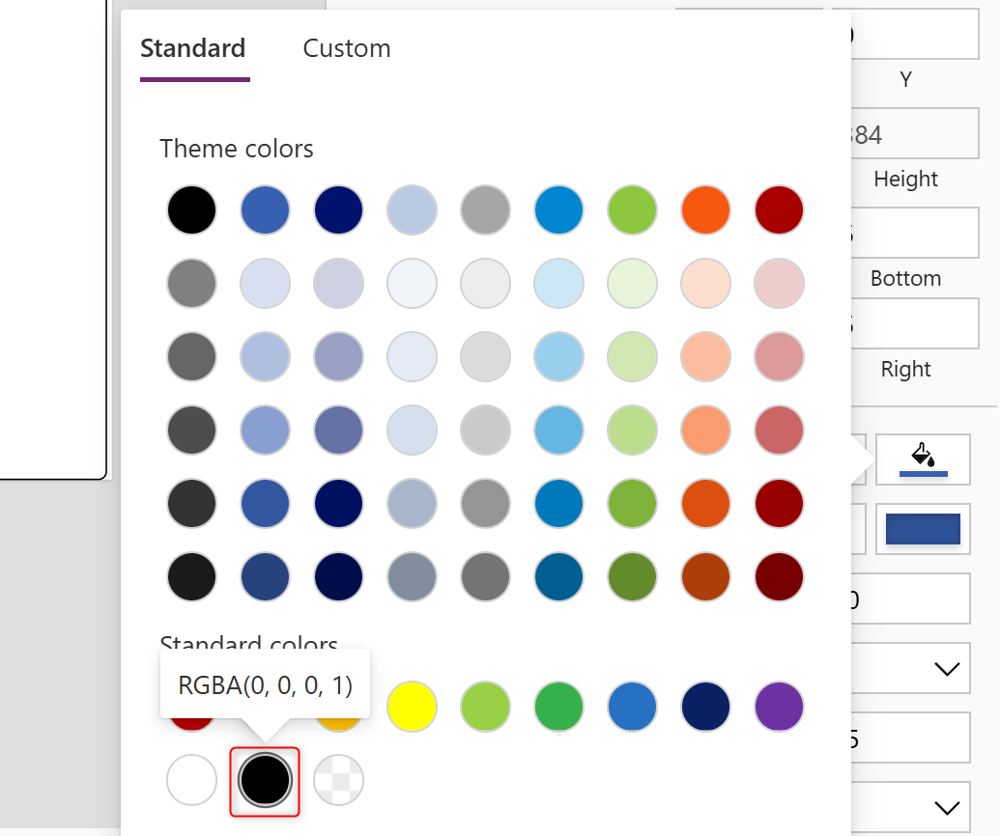
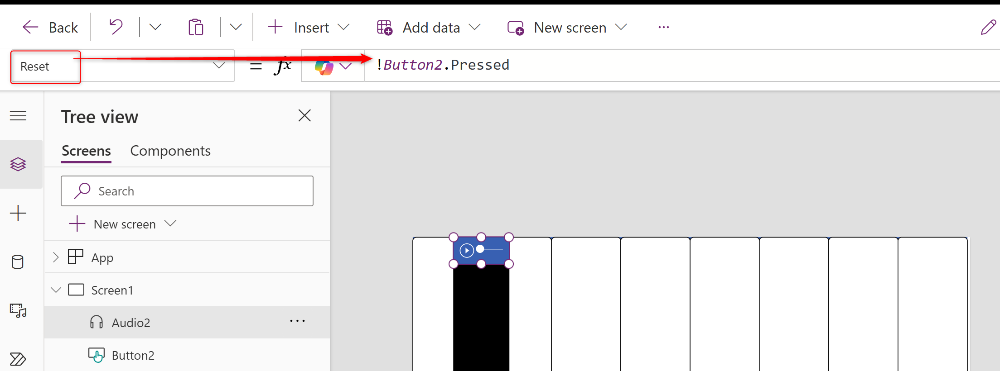

How to create Piano App on Power Apps.

===

## Reference Information.

This procedure manual was prepared by translating site into English.  

[Power Apps でピアノアプリを爆速で作る方法](https://jn.hateblo.jp/entry/2020/09/07/000000)    
> How to make piano apps with Power Apps in a blazing fast way!!
  
Wrote by **[Junichi Kodama](https://x.com/KodamaJn)**.


## First Completed Version.

We will now create such an application.


The range of notes that can be played by this application is one octave from C3 to C4.


## Advance preparation.

* Power Apps environment for free development.  
  ex. [Power Apps Developer Plan](https://www.microsoft.com/en-us/power-platform/products/power-apps/free?msockid=2ad762d298a164e03f9f76f1997365fa)

* Touch panel enabled device.  
ex. Tablet, SmartPhone  
Notice : Android is preferred because iOS has a delay in sound playback.

* Sound Files : [Download Link](https://bit.ly/3LJvnfA)  
   These sound files are customized version of sound file downloaded from "[Electronic Music Studios](https://theremin.music.uiowa.edu/MISpiano.html)" at the University of Iowa.  
Therefore, the copyright of the sound files belongs to the University of Iowa.

## 1. Sound Files Upload.

1. Open [Power Apps Designer](https://make.powerapps.com/).  


2. Click to "Create".  


3. Click to "Blank app".  


4. Click to Blank canvas app's "Create".  


5. Enter an appropriate name in the App name field, and choice to "tablet" on Format radiobox, Finaly click to "Create".  


6. Power Apps Designer is open.  


7. Click to "Media"  in the left pane.


8. Click to "Add Media" and then click to "Upload".


9. When the File Dialog opens, select all the downloaded Soundfiles and click to "open".


10. The selected sound file will be added in the Media menu.


## 2. Create first white piano keyboard.

1. Click to "Tree view"  in the left pane.


2. Click to "Insert" and then click to "Button".


3. Button is generated and moves to the upper left corner of the screen.  
The X and Y values of the position property should be 0.


4. Since we are creating a one-octave white key, enter the following expression for the Width property.  
    ```Javascript
    RoundDown(App.Width/8,0)
    ```
    

5. Enter the following expression for the Height property.
    ```Javascript
    App.Height
    ```
    

6. Click to the Color Fill Propaty, and then change color to White.
  


7. Enter the following expression for the BorderColor property.
    ```Javascript
    Color.Black
    ```


8. Enter the following expression for the HoverFill property.
    ```Javascript
    ColorFade(Color.LightGray, 5%)
    ```
    


9. Click to "Insert" and then click to "Media" > "Audio".


10.  Audio Control is generated and moves to the upper left corner of the screen.  
The X and Y values of the position property should be 0.


11. Enter the following expression for the Width property.  
    ```Javascript
    RoundDown(App.Width/8,0)
    ```
    

12. Click to "Media" property, and select "01-C3".


13. Enter the following expression for the Start property.  
    ```Javascript
    Button1.Pressed
    ```
    

14. Enter the following expression for the Reset property.  
    ```Javascript
    !Button1.Pressed
    ```
> **Explanation Section**  
The audio control plays the specified media when the Start property
is set to True, the specified media is played. Therefore, by using the value of the Pressed property, which determines whether a button is pressed or not, the sound will be played when the key is pressed and will stop when the key is released. Also, setting the Reset property to True will return the media playback position to its initial value. Therefore, the Reset property is set to Pressed with the NOT symbol placed at the beginning.

15. From the Tree View, click the "Button1" menu and click "Reorder" > "Bring to front".


16.  From the Tree View, Shift+click the "Button1" and "Audio1".


17. click the menu and click to "Group".


18. "Button1" and "Audio1"are grouped together to form "Group1".


## 3. Copy and Paste of the white piano keyboards.

1. Select to "Group1" and Press key Ctrl+C.


2. Press Key Ctrl+V then Generate to "Group1_1"


3. Enter the following expression in the X property of "Group1_1".
    ```Javascript
    Self.Width
    ```
    

4. Expand "Group1_1" and select "Audio1_1".


5. Change the media property of "Audio1_1" to "03-D3". 


6. Repeat Ctrl+V 6 more times and change each parameter as shown in the table below.

    |Group Name|"X" property|"Media" Property|
    |:--|:--|:--|
    |Group1_2|```Self.Width*2```|```05-E3```|
    |Group1_3|```Self.Width*3```|```06-F3```|
    |Group1_4|```Self.Width*4```|```08-G3```|
    |Group1_5|```Self.Width*5```|```10-A3```|
    |Group1_6|```Self.Width*6```|```12-B3```|
    |Group1_7|```Self.Width*7```|```21-C4```|

    

## 4. Create first black piano keyboard.

1. Click to "Insert" and then click to "Button".


2. Button is generated.


3. Enter the following expression for the Width property.  
    ```Javascript
    RoundDown(App.Width/10,0)
    ```
    

4. Enter the following expression for the Height property.  
    ```Javascript
    RoundDown(App.Height/2,0)
    ```
    

5. Enter the X and Y properties as follows.  
    X : ```100```  
    Y : ```0```    
    

6. Click to the Color Fill Propaty, and then change color to Black.



7. Erase the value of the Text property


8. Enter the following expression for the HoverFill property.
    ```Javascript
    ColorFade(Color.White, -60%)
    ```
    


9. Click to "Insert" and then click to "Media" > "Audio".


10.  Audio Control is generated and enter the X and Y properties as follows.  
    X : ```Button2.X```  
    Y : ```Button2.Y```
    

11. Enter the following expression for the Width property.  
    ```Javascript
    Button2.width
    ```
    

12. Click to "Media" property, and select "02-Db3".


13. Enter the following expression for the Start property.  
    ```Javascript
    Button2.Pressed
    ```
    

14. Enter the following expression for the Reset property.  
    ```Javascript
    !Button2.Pressed
    ```
    

15. From the Tree View, click the "Button2" menu and click "Reorder" > "Bring to front".


1.   From the Tree View, Shift+click the "Button2" and "Audio2".


2.  click the menu and click to "Group".


1.  "Button2" and "Audio2"are grouped together to form "Group2".


## 5. Copy and Paste of the black piano keyboards.

1. Select to "Group2" and Press key Ctrl+C.


2. Repeat Ctrl+V 4 more times and change each parameter as shown in the table below.

    |Group Name|"X" property|"Media" Property|
    |:--|:--|:--|
    |Group2_1|```272```|```04-Eb3```|
    |Group2_2|```612```|```07-Gb3```|
    |Group2_3|```782```|```09-Ab3```|
    |Group2_4|```952```|```11-Bb3```|

    

3. The piano application is now complete.  
Let's try it out!